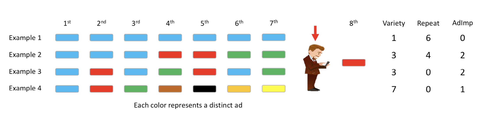

# Project Objective
Our client distribute ads in mobile apps through a mobile ad-distributor. The ad-distributor distributes the client's ads along with ads from other advertisers. We want to help our client understand *how consumers response to the client's ads as well as how does other ads affect the client's ads' effectiveness.*

**How the client's ads will be shown:** In a given session, the client's ads will always be shown in the 8th impression. For the 7 impressions beforehand, the ad-network shows a random set of ads. This means that the earlier ads could have been our client’s ad or it could be one of other advertisers’ who advertise through the same ad-distributor. Thus, there is variation in distribution of ads shown to the users and this variation is random. 

**The Data** 
The data comes from an experiment conducted on a sample of active users. These are users who have exhibited a tendency to spend more time on their mobile apps and engage with ads a lot more than the median user. Thus, we are working with a selected sample of user

**Variables**
1. *click* – Indicator for whether the impression is clicked. 1 implies that a click occured and zero implies that a click did not occur.
2. *timeofday* – Can take one of four values – 1 for late night (12 am to 6 am), 2 for morning (6 am to 12 pm), 3 for afternoon (12 pm to 6 pm), and 4 for early night (6 pm to 12 am).
3. *imptotal* – Total number of impressions shown to this user prior to this session. It captures how active the user has been on her mobile device.
4. *ctruser* – the average CTR the user has had prior to the session.
5. *varietytotal* – total number of distinct ads the user has seen prior to this session.
6. *adimptotal* – total number of impressions of EA’s ad shown to the user prior to this session.
7. *variety* – number of distinct ads shown earlier in the session.
8. *rep* – number of times the ad is replaced with the same ad earlier within this session. (Depicted as
Repeat in the figure.)
9. *adimpsession* – number of times EA’s ad has been shown earlier in the session. (Depicted as AdImp in
the figure.)

Figure 1 illustrates the concepts of *variety*, *replacement*, and *repitition* using a sequence of 8 impressions.



```{r setup, include=FALSE}
knitr::opts_chunk$set(echo = TRUE, message = FALSE, warning = FALSE)
```

# 1. Descriptive Analysis
## 1.1 Load data
```{r}
load("variety_train.RData")
load("variety_test.rdata")

# summary of the training data
str(variety_train)
```

## 1. Take a look at Click-Through-Rate
```{r}
# observed CTR
sum(variety_train$click)/nrow(variety_train)
# average of user's past CTR
mean(variety_train$ctruser)
```

The average observed CTR for EA's ad is 11.3%; The average CTR that users had prior to the session is 11.6%. These numbers are much higher than usual CTRs which are normally less than 1% because they are collected from a small group of very active users. 

## 1.2 Explore in-session variety (*variety*) and pre-session variety (*varietytotal*)
```{r}
# histogram of varieties
# in-session variety
hist(variety_train$variety, main = "in-session variety", xlab = "number of distinct ads shown in the session")
# pre-session variety
hist(variety_train$varietytotal, main = "pre-session variety", xlab = "number of distinct ads the user has seen prior to this session")
```

For in-session variety, 3 or 4 varieties is the most common number of various ads showed in that session; 
For pre-session variety, around 15~30 varieties are the most common number of total various ads showed prior to the current session.

## 1.3 Correlation between in-session variety (*variety*) and number of times a same ad is replaced (*rep*)
```{r}
# correlation between in-session and pre-session variety
cor(variety_train[,c(7:8)])
```

Correlation between in-session variety and in-session ad repetition is -0.7. This implies the more various the ads is, the less repition of same ads there will be.

## 1.4 CTR at each level of in-session *variety*
```{r}
library(ggplot2)
library(gplots)
# plot CTR by each level of in-session variety
plotmeans(click ~ variety, data = variety_train, ylab="CTR", mean.labels = TRUE, connect = FALSE)
```

We find that higher variety is associated with higher likelihood of a click, though this effect tapers off or starts going down with very high variety. The average CTR for showing only 1 distinct ad is 2.8%, comparing to the average CTR of 17.5% if 6 various ads are shown. 

## 1.5 Can we therefore conclude a causal relationship between variety and CTR?
It's hard to conclude a causal relationship merely looking at the plot. However, intuitively it seems like the more ads you show to the customer, the more likely that some of them would be interesting to the customer. For example if one of the customers is an athlete, it would be futile even if you show him/her the ad of a donut for 10 times. Instead, showing him/her the ad of a low-calorie electrolyte drink for one time might catch him/her attention immediately. The more variety of ads shown, the more likely that one of the ad would be interesting to the user. In this case, there's a causal explanation to the observed correlation. 

On the other hand, it can also be merely correlation. For example, high variety of ads means the content displayed change frequently, which is more likely to catch the customer's attention, and hence more likely to result in a click. If that's the case, as long as the ad can catch the attention of the customer it would be effective. For example, just show 1 ad and flash that ad occasionally. 

<br>


# 2. Predicting CTR using 2 Machine learning models
Now we want to predict the Click-Through-Rate of each prospect by building 2 machine learning models, Classification Tree and XGBoost, using all the features available.

## 2.1. CART
For the CART model, we hand picked a cp (complexity parameter) of 0.0003 after manually trying a couple of possible cps.
```{r}
library(rpart)
library(rpart.plot)
library(caret)
from <- click ~ .

# fit with a CART model
tree <- rpart(formula = from, data = variety_train, 
                         control = rpart.control(cp = 0.0003))
```

```{r}
# visualize the CART model
rpart.plot(tree)
```

**Findings:**
- The tree has 17 leaf nodes. 

- It uses the following variables for splitting: 'ctruser', 'variety', 'adimpression'

- 'ctruser' matters the most

- 'timeofday', 'imptotal', 'varietytotal', 'rep' and 'adimptotal' are omitted

The cluster with the highest projected CTR are prospects who has a historical CTR of greater than 45% prior to this session, and is shown greater than or equal to 4 distinct ads in this session; The cluster with the lowest CTR are those who has a CTR of less than 7.5% before, and is shown less than 4 distinct ads in this session. 

## 2.2 CART Prediction
```{r}
# predict using the tree model
pred.CART <- predict(tree, variety_test)
# add as a new column in the test set
variety_test$CART.pred <- pred.CART
```

## 2.3 XGBoost Tunning and Fitting
```{r}
# fit with xgboost
col.xgb = c(2:9)
```

**Hyperparameter Tuning**
- nrounds: controls the maximum number of iterations. For classification, it is similar to the number of trees to grow.

- eta: It controls the learning rate, i.e., the rate at which our model learns patterns in data. After every round, it shrinks the feature weights to reach the best optimum.

- max_depth: It controls the depth of the tree. Larger the depth, more complex the model; higher chances of over-fitting. 

- gamma: It controls regularization (or prevents over-fitting). The optimal value of gamma depends on the data set and other parameter values.

- colsample_bytree: It control the number of features (variables) supplied to a tree

```{r cache=TRUE}
library(xgboost)
# set up the cross-validated hyper-parameter search
xgb_grid = expand.grid(
  eta = c(0.1, 0.2),
  nrounds = c(50,100),
  max_depth = c(4,6,8),
  gamma = c(0,1,5),
  colsample_bytree=c(0.5,0.75,1),
  min_child_weight=c(1,3,5),
  subsample=1
)

# pack the training control parameters
xgb_trcontrol = trainControl(
  method = "cv",
  number = 5,
  verboseIter = TRUE,
  returnData = FALSE,
  returnResamp = "all",               # save losses across all models
  classProbs = TRUE,                  # set to TRUE for AUC to be computed
  summaryFunction = twoClassSummary,
  allowParallel = TRUE,
)

# train the model for each parameter combination in the grid,
# using CV to evaluate
train_target = ifelse(variety_train[,1]==1, 'yes','no')
xgb_train_1 = caret::train(x=data.matrix(variety_train[,col.xgb]), 
                           y=train_target, 
                           trControl = xgb_trcontrol, 
                           tuneGrid = xgb_grid, 
                           method = "xgbTree")
```

**XGBoost Fitting**
```{r}
xgb.full <- xgboost(data = data.matrix(variety_train[,col.xgb]), 
                  label = variety_train[,1], 
                  eta = 0.1,
                  max_depth = 4, 
                  nround=100, 
                  subsample = 1,
                  colsample_bytree = 0.5,
                  num_class = 1,
                  min_child_weight = 3,
                  gamma = 5,
                  nthread = 30,
                  eval_metric = "logloss",
                  objective = "binary:logistic",
                  verbose = 0
                  )
```

## 2.4 XGB Prediction
```{r}
# predict using the xgboost model
pred.xgb <- predict(xgb.full, as.matrix(variety_test[,col.xgb]))
# add as a new col to the test set
variety_test$xgb.pred <- pred.xgb
```


<br>

# 3. Model Evaluation
## 3.1 AUC
```{r}
# AUC
library(pROC)
# CART
auc.cart= roc(variety_test$click, variety_test$CART.pred)
auc.cart


# xgb
auc.xgb = roc(variety_test$click, variety_test$xgb.pred)
auc.xgb


# summary of result
auc.result <- data.frame("AUC" = c(auc(auc.cart), auc(auc.xgb)))
row.names(auc.result) <- c("CART", "XGBOOST")
auc.result
```

The XGBoost model performs slightly better with an AUC of 0.667. Let's plot the ROC curve for the XGBoost model.

## 3.2 ROC Plot
```{r}
#plot the ROC on the test set
library(ROCR)
ROCRPred <- prediction(variety_test$xgb.pred, variety_test$click)
ROCRperf <- performance(ROCRPred,"tpr","fpr")
plot(ROCRperf, colorize=TRUE, print.cutoffs.at=seq(0.1,1,by=0.1), text.adj=c(-0.2,1.7), main='ROC Plot for XGBoost')
```

## 3.3 Feature Importance
```{r}
#view variable importance plot
mat <- xgb.importance (feature_names = colnames(variety_test[,-1]),model = xgb.full)
xgb.plot.importance (importance_matrix = mat[1:8]) 
```

The finding is consistent with what we found in the descriptive analysis, where the pre-session variable of *ctruser* (historical CTR) serves as the most robust predictor for future CTRs. The second most important variable is *variety* which refers to the variety of ads shows with-in the target session.

<br>

# 4. Summarize findings
## a. What is the relative value of within-session user history vs. pre-session user history?
According to the descriptive analysis and feature importance generated by the XGBoost model , pre-session user history brings in greater value than within-session user history in terms of prediction power for user's CTR in the 8th session. This conclusion is validated by both of the models we applied: The tree model makes its first split (which indicates the most important variable) by 'ctruser', which is a pre-session variable; and the XGBoost rank the same variable as the most important predictor.


## b. What is the effect (positive or negative) of within-session variety on users’ ad response?
According to the 'mean-by-group plot' in step1, high variety seems to have a strong positive effect on user's CTR. However, from the 'variety bar plot' in step1, ad-network is currently showing 3-4 variety most often, which contradicts our findings. Our suggestion will be to show more diverse ads within a single session.


<br>

# 5. Business Implications
Our client currently buys all the impression in the test data. Going forward, the client wants to take advantage of the model and only buys the top 5,000 impression which yields the highest CTR.

## 5.1 First, identify the top 5,000 impressions with the highest projected CTR
```{r}
# top 5000 impressions with the highest predicted CTR
top5000 <- variety_test[order(-variety_test$xgb.pred),]
top5000 <- top5000[1:5000,]
```

## 5.2 Gets the average CTR for the top 5,000 impressions
```{r}
# Average CTR of the top5000 impressions
mean(top5000$click)
# Average predicted CTR of the top5000 impressions
mean(top5000$xgb.pred)
```

- The average CTR of the top5000 impressions is 19.6%
- The average predicted CTR of the top5000 impressions is 19.1%
The predicted average CTR is similar to the actual CTR

## 5.3 It costs our client \$0.05  for each impression bought, and each click will generates a revenue of \$2. Let's first calculate the base ROI if the client buys all impressions.
### i. Base ROI
```{r}
# Baseline ROI
cost.per.imp <- 0.05
marginal.gain <- 2

total.gain.base <- sum(marginal.gain * variety_test$click) 
total.spend.base <- cost.per.imp * nrow(variety_test)

#Base ROI
(total.gain.base-total.spend.base)/total.spend.base
```

The base ROI is 351% if the client buys all the impressions in the test data.

### 5.4 Now let's calculate the ROI if our client only buys the top 5,000 most promissing impressions
```{r}
# top 5000 ROI
total.gain.top <- sum(marginal.gain * top5000$click)
total.spend.top <- cost.per.imp * nrow(top5000)

# Top 5000 ROI
(total.gain.top-total.spend.top)/total.spend.top
```

The ROI goes up to 685% if our clinet only buys the top 5000 impressions, almost doubles the base ROI!

## 5.5 Assuming that there is another marketing activity (price promotions) which has an ROI of 5. Suppose the client has a total of $1,000 to invest in price promotions and advertising. How should the client distribute this money between advertising and price promotions. Specifically, how many of the top impressions should the client buy (consider only multiples of 500, e.g., 500 impressions, 1000 impressions and so on)

```{r}
# Create a sequence for impression numbers
num_imp <- seq(500,20000, 500)
# Create a sorted test data for subset
sorted <- variety_test[order(-variety_test$xgb.pred),]
# construct an empty vector to store the resulted ROI
result <- as.data.frame(num_imp)

# build a for loop that calculate the ROI for all possible numbers of impressions
for (num in num_imp) {
  # subset the sorted test data, getting only the top 'num' rows
  top <- sorted[1:num,]
  # calculate ROI
  total.gain <- sum(marginal.gain * top$click)
  total.spend <- cost.per.imp * num
  ROI <- (total.gain - total.spend)/total.spend
  result$ROI[num/500] <-ROI
}
result[result$ROI < 5.5 & result$ROI > 4.5,]
```

From the result table we can see the ROI drops below 5 after 12,000 impressions. The cost for targeting 12,000 impressions is:
```{r}
12000*cost.per.imp
```

The client is better off to spend on targeting the first top 12,000 impressions than spending on the alternative marketing activity. It costs them \$600 to do so. However, after the top 12,000 impressions are targeted, the client should spend the rest \$400 on the alternative price promotion because it generates higher return.


